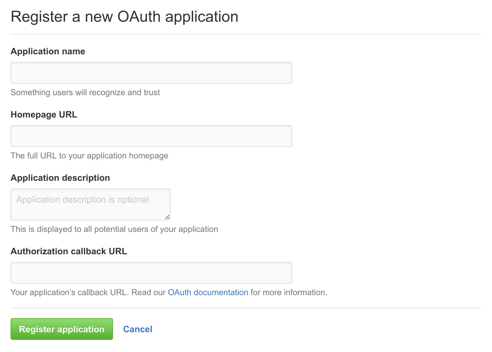

# Software Sustainability Institute's Fellowship Administration Tool

Software Sustainability Institute internal tool to administrate the Fellowship
programme.

## Dependencies

- Python 3
- Django
- SQLite 3

### Dependencies Resolution on Debian and Ubuntu

~~~
$ sudo apt-get install python3 sqlite3
$ sudo python3 -m pip install -r requirements.txt
~~~

## Initialization

**Only run the following commands after you clone this repository
or when you pull new commits.**

Need to get CSS files,
create local database, and
load "static" pages.

~~~
$ ./bootstrap.sh
$ python3 manage.py migrate
$ python3 manage.py loaddata fixtures/flatpages.json
~~~

## Super User

To create super user:

~~~
$ python3 manage.py createsuperuser
~~~

## Run

~~~
$ python3 manage.py runserver
~~~

## Backup

We use [django-dbbackup](http://django-dbbackup.readthedocs.io/)
for backup of the data. To create a new backup, run

~~~
$ python3 manage.py dbbackup && python3 manage.py mediabackup
~~~

## Testing

If you want to test, follow the instructions:

~~~
$ python3 manage.py loaddata fixtures/demo.json
~~~

You can log in with the follow users

| Username | Password    |
| -------- | ----------- |
| admin    | 123admin456 |
| arrow    | arrarrarr   |
| captain  | capcapcap   |
| hulk     | hulhulhul   |
| iron     | iroiroiro   |
| widow    | widwidwid   |

To export your changes on the database, run

~~~
$ python3 manage.py dumpdata --indent 4 fat > fixtures/demo.json
$ git commit -am 'Update database'
$ git push origin master
~~~

## Development

### File System

- `backups`

  Store the backups created by django-dbbackup.

- `bootstrap.sh`

  File to download CSS files.

- `db.sqlite3`

  Local database.

- `fat/`

  Django application root.

- `fixtures/`

  Data used when testing.

- `manage.py

  Django command line script.

- `README.md`

  Root of documentation.

- `requirements.txt`

  Python dependencies used by `pip`.

- `upload/`

  Where user upload files are stored.

### GitHub OAuth

For authentication with GitHub work you need to visit
https://github.com/settings/applications/new and fill it.

As answer you can use:

- Application name: **FAT**
- Homepage URL: **http://fat.your.domain**
- Application description: **Fellows Administration Tool**
- Authorization callback URL: **http://fat.your.domain/complete/github/**

### Unit Test

To run the unit test collection:

~~~
$ python3 manage.py test
~~~
